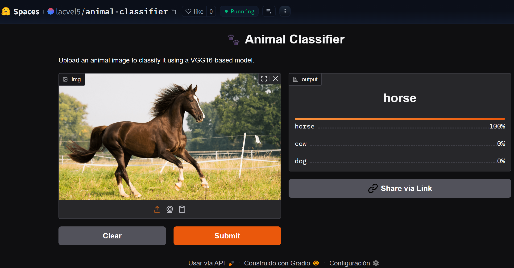

# 🐾 Image Classification with CNN

This project was built as part of the AI Engineering Bootcamp at Ironhack. The goal was to develop a deep learning model to classify animal images using Convolutional Neural Networks (CNNs).

[👉 Project Instructions & Guidelines](https://github.com/ironhack-labs/project-1-deep-learning-image-classification-with-cnn)

-------------------------

## 📊 Project Summary
We tackled the Animals-10 dataset, containing images from 10 animal categories (e.g. dog, cat, elephant, butterfly). Our work focused on model experimentation, optimization, and deployment.


**Key Achievements:** 

- 🧠 Built multiple CNN models from scratch

- 📈 Achieved 91.02% accuracy on holdout data

- 🔁 Implemented transfer learning using VGG16

- ☁️ Deployed final model as an interactive web app

- 🖼️ Users can upload any animal image and receive predictions in real-time


--------------------------

## 🗂️ Project Structure

Here is a short description of the folder and files available on the repository.

### 📁 Documents
- holdout_subset.zip. You can use these images to predict with the model

### 📁 Notebooks  
- [Split_Validation_Data](Split_Validation_Data): split the data set to one set for training and testing (90%) and a second one to make predictions (10%)
- [Model1](Notebooks/Model1.ipynb) : The starting point model
- [Model2(optimized)](Notebooks/Model2(optimized).ipynb) : The optimized model
- [Transfer_learning(winner_model)](Notebooks/Transfer_learning(winner_model).ipynb) : Using VGG16 to predict the data set
- [Deploy_gradio](Deploy_gradio.ipynb) : Notebook to deploy the model to a website by using gradi


-----------------------

## ⚙️ Setup & Installation

To run locally:

````

pip install -r requirements.txt


````

----------------------

## 🚀 Deployment

The final model is deployed and live on Hugging Face Spaces:

[👉 Try the App](https://huggingface.co/spaces/lacvel5/animal-classifier)



🔍 How It Works

- Upload an image of an animal

- The model processes and classifies it using the VGG16-based fine-tuned network

- The prediction is returned instantly via a simple, clean interface

--------------------

## 🏁 Final Thoughts

This project was an end-to-end deep learning challenge: from data wrangling, model tuning, evaluation, to real-world deployment. It demonstrates the practical power of CNNs and transfer learning in visual classification tasks.
